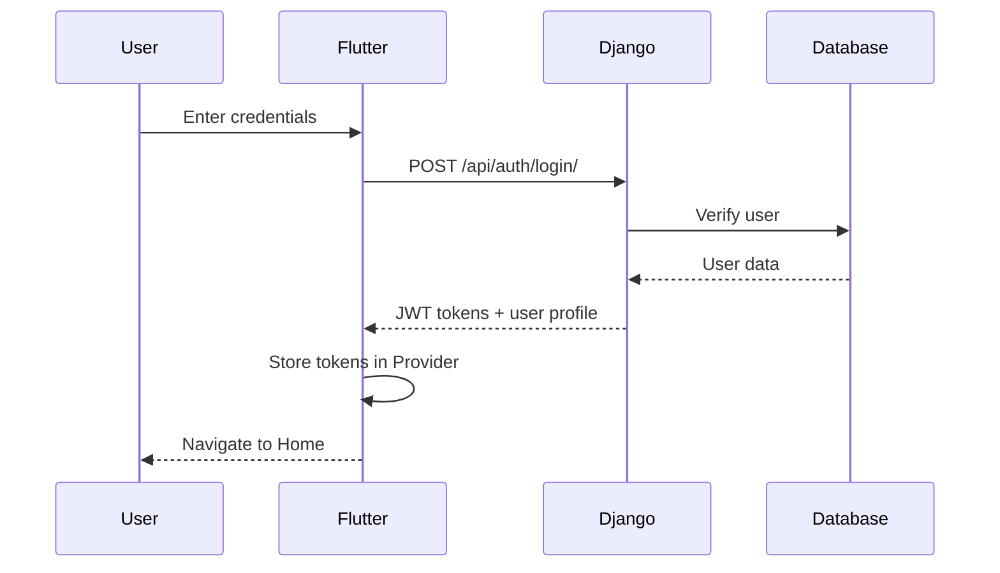
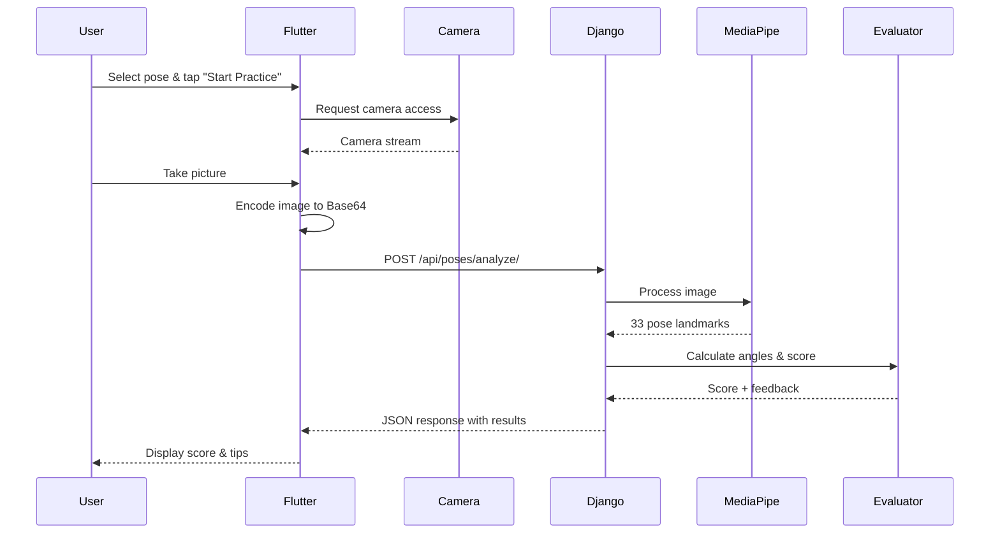
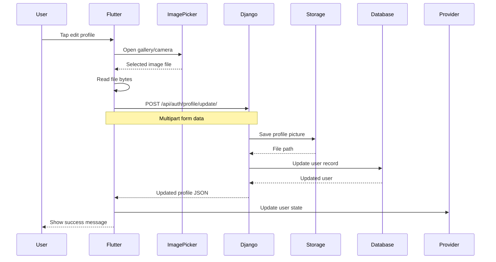

# YogAI - AI-Powered Yoga Pose Detection App

<div align="center">


[](https://flutter.dev)
[](https://www.djangoproject.com/)
[](https://www.python.org/)
[](https://google.github.io/mediapipe/)
[](LICENSE)

**AI-powered real-time yoga pose detection with instant feedback and hands-free gesture control**

[Features](#features) • [Quick Start](#quick-start) • [Setup](#installation--setup) • [Architecture](#architecture) • [API Docs](#api-documentation) • [Contributing](#contributing)

</div>

---

## Table of Contents

- [Overview](#overview)
- [Features](#features)
- [Tech Stack](#tech-stack)
- [System Requirements](#system-requirements)
- [Installation & Setup](#installation--setup)
  - [Windows](#windows-setup)
  - [macOS](#macos-setup)
  - [Linux](#linux-setup)
- [Architecture](#architecture)
- [Data Flow](#data-flow)
- [API Documentation](#api-documentation)
- [Camera Processing](#camera--image-processing)
- [Available Poses](#available-yoga-poses)
- [Usage Guide](#usage-guide)
- [Configuration](#configuration)
- [Troubleshooting](#troubleshooting)
- [Contributing](#contributing)
- [License](#license)
- [Authors](#authors)

---

## Overview

**YogAI** is a cross-platform mobile application that uses advanced AI and computer vision to analyze yoga poses in real-time. Built with Flutter for the frontend and Django for the backend, it leverages Google's MediaPipe for accurate pose detection and provides instant feedback to help users improve their yoga practice.

### Key Highlights

- **Real-time Pose Analysis** - Instant feedback on pose accuracy (0-100% score)
- **AI-Powered Detection** - MediaPipe-based skeletal tracking with 33 body landmarks
- **Hands-Free Control** - Gesture recognition for controlling tracking (Open Palm to pause, Thumbs Up to play)
- **Cross-Platform** - Works on Android, iOS, and Web
- **Secure Authentication** - JWT-based user authentication with profile management
- **Modern UI** - Carbon Design System with swipeable tabs
- **Progress Tracking** - Track sessions, streaks, and practice time

---

## Features

### Core Features

| Feature | Description |
|---------|-------------|
| **5 Yoga Poses** | Tree, Cobra, Warrior I, Warrior II, Warrior III |
| **Live Pose Detection** | Real-time camera feed analysis with skeletal overlay |
| **Image Analysis** | Upload photos from gallery for pose evaluation |
| **Accuracy Scoring** | 0-100% score based on joint angles and body alignment |
| **Instant Feedback** | Personalized tips and corrections for improvement |
| **Hand Gestures** | Open Palm (Pause), Thumbs Up (Resume) |
| **User Profiles** | Secure login, profile picture, and settings management |
| **Statistics Dashboard** | Track sessions, minutes practiced, and streaks |

### Technical Features

- **JWT Authentication** - Secure token-based authentication
- **Image Processing** - Base64 encoding for efficient image transfer
- **MediaPipe Integration** - 33-point pose landmark detection
- **Carbon Design System** - Consistent, modern UI design
- **PageView Navigation** - Swipeable tabs like Facebook
- **State Management** - Provider pattern for reactive state
- **Error Handling** - Comprehensive error messages and validation

---

## Tech Stack

### Frontend (Mobile App)

```yaml
Framework: Flutter 3.9.0+
Language: Dart
UI Design: Carbon Design System
State Management: Provider
Key Packages:
  - camera: ^0.10.5         # Camera access
  - http: ^1.1.0            # API communication
  - provider: ^6.1.0        # State management
  - image_picker: ^1.0.5    # Gallery access
  - google_sign_in: ^6.1.6  # OAuth integration
```

### Backend (API Server)

```yaml
Framework: Django 5.2.6
Language: Python 3.10+
API: Django REST Framework
Authentication: JWT (djangorestframework-simplejwt)
Key Dependencies:
  - djangorestframework: ^3.14.0
  - djangorestframework-simplejwt: ^5.3.0
  - django-cors-headers: ^4.3.0
  - Pillow: ^10.1.0
```

### AI/ML (Pose Detection)

```yaml
Framework: MediaPipe (Google)
Computer Vision: OpenCV 4.8+
Numerical Computing: NumPy
Key Components:
  - mediapipe.solutions.pose
  - cv2 (OpenCV)
  - numpy
```

---

## System Requirements

### Minimum Requirements

| Component | Requirement |
|-----------|-------------|
| **OS** | Windows 10+, macOS 10.14+, Ubuntu 18.04+ |
| **RAM** | 4 GB (8 GB recommended) |
| **Storage** | 2 GB free space |
| **Camera** | Webcam or phone camera |
| **Network** | WiFi for phone-computer sync |

### Software Requirements

- **Flutter SDK** 3.9.0 or higher
- **Python** 3.10 or higher
- **Git** (for cloning repository)
- **Code Editor** (VS Code, Android Studio, or IntelliJ)

---

## Installation & Setup

### Windows Setup

#### 1. Install Prerequisites

```powershell
# Install Chocolatey (Package Manager)
Set-ExecutionPolicy Bypass -Scope Process -Force
[System.Net.ServicePointManager]::SecurityProtocol = [System.Net.ServicePointManager]::SecurityProtocol -bor 3072
iex ((New-Object System.Net.WebClient).DownloadString('https://chocolatey.org/install.ps1'))

# Install Git
choco install git -y

# Install Python 3.10
choco install python --version=3.10 -y

# Verify installations
git --version
python --version
```

#### 2. Install Flutter

```powershell
# Download Flutter SDK
# Go to https://docs.flutter.dev/get-started/install/windows
# Download the zip and extract to C:\src\flutter

# Add to PATH (System Environment Variables)
# Add: C:\src\flutter\bin

# Verify Flutter
flutter doctor

# Accept Android licenses
flutter doctor --android-licenses
```

#### 3. Clone & Setup Project

```powershell
# Clone repository
git clone https://github.com/nishanshrestha04/trinova.git
cd trinova

# Install Flutter dependencies
flutter pub get

# Create Python virtual environment
python -m venv env

# Activate virtual environment
.\env\Scripts\activate

# Install Python dependencies
pip install django djangorestframework djangorestframework-simplejwt django-cors-headers opencv-python mediapipe numpy pillow

# Run database migrations
cd backend
python manage.py migrate
cd ..
```

#### 4. Start Backend

```powershell
# Method 1: Using provided script (Git Bash)
./start_backend.sh

# Method 2: Manual start
cd backend
python manage.py runserver 0.0.0.0:8000
```

#### 5. Run Flutter App

```powershell
# For Web (Chrome)
flutter run -d chrome

# For Android/iOS (with device connected)
flutter run

# For Windows Desktop
flutter run -d windows
```

---

### macOS Setup

#### 1. Install Prerequisites

```bash
# Install Homebrew (Package Manager)
/bin/bash -c "$(curl -fsSL https://raw.githubusercontent.com/Homebrew/install/HEAD/install.sh)"

# Install Git
brew install git

# Install Python 3.10
brew install python@3.10

# Verify installations
git --version
python3 --version
```

#### 2. Install Flutter

```bash
# Download Flutter SDK
cd ~/development
git clone https://github.com/flutter/flutter.git -b stable

# Add to PATH (in ~/.zshrc or ~/.bash_profile)
echo 'export PATH="$PATH:$HOME/development/flutter/bin"' >> ~/.zshrc
source ~/.zshrc

# Verify Flutter
flutter doctor

# Install CocoaPods (for iOS)
sudo gem install cocoapods
```

#### 3. Clone & Setup Project

```bash
# Clone repository
git clone https://github.com/nishanshrestha04/trinova.git
cd trinova

# Install Flutter dependencies
flutter pub get

# Create Python virtual environment
python3 -m venv env

# Activate virtual environment
source env/bin/activate

# Install Python dependencies
pip install django djangorestframework djangorestframework-simplejwt django-cors-headers opencv-python mediapipe numpy pillow

# Run database migrations
cd backend
python manage.py migrate
cd ..
```

#### 4. Start Backend

```bash
# Make script executable
chmod +x start_backend.sh

# Run backend
./start_backend.sh

# Or manually:
cd backend
python manage.py runserver 0.0.0.0:8000
```

#### 5. Run Flutter App

```bash
# For Web (Chrome)
flutter run -d chrome

# For iOS Simulator
open -a Simulator
flutter run

# For macOS Desktop
flutter run -d macos
```

---

### Linux Setup

#### 1. Install Prerequisites

```bash
# Update package list
sudo apt update

# Install Git
sudo apt install git -y

# Install Python 3.10
sudo apt install python3.10 python3.10-venv python3-pip -y

# Install required build tools
sudo apt install curl unzip xz-utils zip libglu1-mesa -y

# Verify installations
git --version
python3 --version
```

#### 2. Install Flutter

```bash
# Download Flutter SDK
cd ~/development
wget https://storage.googleapis.com/flutter_infra_release/releases/stable/linux/flutter_linux_3.9.0-stable.tar.xz
tar xf flutter_linux_3.9.0-stable.tar.xz

# Add to PATH (in ~/.bashrc)
echo 'export PATH="$PATH:$HOME/development/flutter/bin"' >> ~/.bashrc
source ~/.bashrc

# Verify Flutter
flutter doctor

# Accept Android licenses
flutter doctor --android-licenses
```

#### 3. Clone & Setup Project

```bash
# Clone repository
git clone https://github.com/nishanshrestha04/trinova.git
cd trinova

# Install Flutter dependencies
flutter pub get

# Create Python virtual environment
python3 -m venv env

# Activate virtual environment
source env/bin/activate

# Install Python dependencies
pip install django djangorestframework djangorestframework-simplejwt django-cors-headers opencv-python mediapipe numpy pillow

# Run database migrations
cd backend
python manage.py migrate
cd ..
```

#### 4. Start Backend

```bash
# Make script executable
chmod +x start_backend.sh

# Run backend
./start_backend.sh

# Or manually:
cd backend
python manage.py runserver 0.0.0.0:8000
```

#### 5. Run Flutter App

```bash
# For Web (Chrome)
flutter run -d chrome

# For Linux Desktop
flutter run -d linux

# For Android (with device connected via USB)
flutter run
```

---

## Architecture

### System Architecture

```
┌─────────────────────────────────────────────────────────────┐
│                     YogAI System Architecture               │
└─────────────────────────────────────────────────────────────┘

┌──────────────────┐          HTTP/REST           ┌─────────────────┐
│                  │◄─────────────────────────────┤                 │
│  Flutter App     │         JSON/Base64          │  Django Backend │
│  (Frontend)      ├──────────────────────────────►  (API Server)   │
│                  │                              │                 │
└────────┬─────────┘                              └────────┬────────┘
         │                                                 │
         │ Camera/Gallery                                  │
         │ Image Capture                                   │
         │                                                 │
         ▼                                                 ▼
┌──────────────────┐                              ┌──────────────────┐
│  Device Camera   │                              │ MediaPipe Engine │
│  - Live Feed     │                              │ - Pose Detection │
│  - Image Picker  │                              │ - Landmark Track │
│  - Base64 Encode │                              │ - Angle Calc     │
└──────────────────┘                              └────────┬─────────┘
                                                           │
                                                           ▼
                                                  ┌──────────────────┐
                                                  │ Pose Evaluators  │
                                                  │ - Tree           │
                                                  │ - Cobra          │
                                                  │ - Warrior I/II/III│
                                                  └──────────────────┘
```

### Project Structure

```
trinova/
│
├── lib/                          # Flutter Application (Frontend)
│   ├── main.dart                 # App entry point
│   ├── models/                   # Data models
│   │   └── user.dart             # User model with profile data
│   ├── pages/                    # UI Pages
│   │   ├── home_page.dart        # Main app with 3 tabs (Home/Poses/Profile)
│   │   ├── unified_pose_tracker_page.dart  # Live pose tracking
│   │   ├── settings_page.dart    # Profile settings & image upload
│   │   └── auth/
│   │       ├── login_page.dart   # Login UI
│   │       └── register_page.dart # Registration UI
│   ├── services/                 # API Communication Layer
│   │   ├── auth_service.dart     # Auth API calls (login/register/profile)
│   │   └── pose_service.dart     # Pose API calls (analyze/available poses)
│   ├── providers/                # State Management
│   │   └── auth_provider.dart    # User authentication state
│   └── utils/                    # Utilities
│       └── yoga_gesture_detector.dart  # Hand gesture detection
│
├── backend/                      # Django Backend (API Server)
│   ├── authentication/           # User Authentication Module
│   │   ├── models.py             # User models (extends Django User)
│   │   ├── views.py              # Auth endpoints (register/login/profile)
│   │   └── urls.py               # Auth URL routing
│   ├── poses/                    # Pose Detection Module
│   │   ├── views.py              # Pose endpoints (analyze/available/tips)
│   │   ├── urls.py               # Pose URL routing
│   │   └── gesture_detector.py   # Hand gesture recognition logic
│   ├── backend/                  # Django Project Settings
│   │   ├── settings.py           # Django configuration (CORS, JWT, etc.)
│   │   └── urls.py               # Main URL routing
│   ├── media/                    # User uploaded files
│   │   └── profile_pictures/     # Profile images storage
│   ├── manage.py                 # Django CLI tool
│   └── db.sqlite3                # SQLite database
│
├── Physio/                       # Pose Detection Engine (Python)
│   ├── main.py                   # CLI interface for pose detection
│   ├── requirements.txt          # Python dependencies
│   └── src/
│       ├── evaluators/           # Pose Evaluation Logic
│       │   ├── tree.py           # Tree pose evaluator
│       │   ├── cobra.py          # Cobra pose evaluator
│       │   ├── warrior1.py       # Warrior I evaluator
│       │   ├── warrior2.py       # Warrior II evaluator
│       │   └── warrior3.py       # Warrior III evaluator
│       ├── pose_runner.py        # Webcam pose detection runner
│       └── utils/
│           └── angle_calculator.py  # Joint angle calculations
│
├── android/                      # Android-specific files
│   └── app/src/main/AndroidManifest.xml  # Camera permissions
│
├── ios/                          # iOS-specific files
│   └── Runner/Info.plist         # Camera permissions
│
├── start_backend.sh              # Backend startup script
└── README.md                     # This file
```

---

## Data Flow

### 1. Authentication Flow



**Detailed Steps:**

1. **User Input** - User enters username/email and password
2. **HTTP Request** - Flutter sends POST request with JSON body:
   ```json
   {
     "username": "user@email.com",
     "password": "securepass123"
   }
   ```
3. **Django Processing**:
   - Validates credentials
   - Generates JWT access & refresh tokens
   - Fetches user profile data
4. **Response** - Django returns:
   ```json
   {
     "access_token": "eyJ0eXAiOiJKV1QiLCJhbGc...",
     "refresh_token": "eyJ0eXAiOiJKV1QiLCJhbGc...",
     "user": {
       "id": 1,
       "username": "nishanshrestha",
       "email": "user@email.com",
       "first_name": "Nishan",
       "last_name": "Shrestha",
       "profile_picture": "http://...../media/profile.jpg",
       "date_joined": "2025-01-01T00:00:00Z"
     }
   }
   ```
5. **State Update** - AuthProvider stores user data and tokens
6. **UI Update** - App navigates to HomePage

---

### 2. Pose Analysis Flow



**Detailed Steps:**

1. **Pose Selection** - User selects a pose (e.g., "Tree Pose")
2. **Camera Capture**:
   - Flutter opens camera using `camera` package
   - User positions themselves
   - Captures image (JPG format)
3. **Image Encoding**:
   ```dart
   // Convert image to base64
   final bytes = await image.readAsBytes();
   final base64Image = base64Encode(bytes);
   ```
4. **API Request**:
   ```dart
   POST http://192.168.1.100:8000/api/poses/analyze/
   Headers: {
     "Content-Type": "application/json"
   }
   Body: {
     "pose": "tree",
     "image": "data:image/jpeg;base64,/9j/4AAQSkZJRgABAQAAAQABAAD..."
   }
   ```
5. **Backend Processing**:
   ```python
   # Decode base64 image
   image_data = base64.b64decode(image_base64)
   nparr = np.frombuffer(image_data, np.uint8)
   image = cv2.imdecode(nparr, cv2.IMREAD_COLOR)
   
   # MediaPipe pose detection
   results = pose.process(cv2.cvtColor(image, cv2.COLOR_BGR2RGB))
   landmarks = results.pose_landmarks.landmark
   
   # Extract 33 landmarks (x, y, z, visibility)
   # Calculate joint angles (knee, elbow, hip, etc.)
   # Run pose-specific evaluator
   ```
6. **Pose Evaluation**:
   ```python
   # Example: Tree Pose Evaluator
   - Check if one foot is raised
   - Verify knee angle (standing leg ~180°)
   - Check hip alignment
   - Verify raised foot position on thigh
   - Calculate final score (0-100%)
   ```
7. **Response**:
   ```json
   {
     "success": true,
     "score": 85,
     "feedback": "Great job! Try to keep your hips more aligned.",
     "tips": [
       "Engage your core for better balance",
       "Focus your gaze on a fixed point",
       "Press your foot firmly into your thigh"
     ],
     "landmarks": [
       {"x": 0.5, "y": 0.3, "z": -0.1, "visibility": 0.99},
       ...
     ]
   }
   ```
8. **UI Display**:
   - Show score with visual progress indicator
   - Display feedback message
   - List improvement tips
   - Overlay skeleton on image (optional)

---

### 3. Profile Update Flow



**Detailed Steps:**

1. **Image Selection**:
   ```dart
   final picker = ImagePicker();
   final image = await picker.pickImage(
     source: ImageSource.gallery,
     maxWidth: 512,
     maxHeight: 512,
     imageQuality: 75
   );
   ```
2. **Multipart Form Upload**:
   ```dart
   var request = http.MultipartRequest(
     'POST',
     Uri.parse('$baseUrl/auth/profile/update/')
   );
   request.fields['first_name'] = 'Nishan';
   request.fields['last_name'] = 'Shrestha';
   request.files.add(await http.MultipartFile.fromPath(
     'profile_picture',
     image.path
   ));
   ```
3. **Django Processing**:
   - Validates image format (JPG, PNG)
   - Resizes if needed
   - Saves to `media/profile_pictures/`
   - Updates database with new path
4. **Response**:
   ```json
   {
     "success": true,
     "message": "Profile updated successfully!",
     "user": {
       "id": 1,
       "username": "nishanshrestha",
       "first_name": "Nishan",
       "last_name": "Shrestha",
       "profile_picture": "http://.../media/profile_pictures/user_1_profile.jpg"
     }
   }
   ```

---

## API Documentation

### Base URL

```
Local Development: http://localhost:8000
Network Access:     http://<YOUR_IP>:8000
```

### Authentication Endpoints

#### 1. Register New User

```http
POST /api/auth/register/
Content-Type: application/json
```

**Request Body:**
```json
{
  "username": "nishanshrestha",
  "email": "nishan@example.com",
  "password": "securePassword123",
  "first_name": "Nishan",
  "last_name": "Shrestha"
}
```

**Response (201 Created):**
```json
{
  "message": "User created successfully",
  "access_token": "eyJ0eXAiOiJKV1QiLCJhbGc...",
  "refresh_token": "eyJ0eXAiOiJKV1QiLCJhbGc...",
  "user": {
    "id": 1,
    "username": "nishanshrestha",
    "email": "nishan@example.com",
    "first_name": "Nishan",
    "last_name": "Shrestha",
    "date_joined": "2025-01-01T00:00:00Z",
    "profile_picture": null
  }
}
```

**Error Response (400 Bad Request):**
```json
{
  "error": "Username already exists"
}
```

---

#### 2. Login

```http
POST /api/auth/login/
Content-Type: application/json
```

**Request Body:**
```json
{
  "username": "nishan@example.com",
  "password": "securePassword123"
}
```

**Response (200 OK):**
```json
{
  "message": "Login successful",
  "access_token": "eyJ0eXAiOiJKV1QiLCJhbGc...",
  "refresh_token": "eyJ0eXAiOiJKV1QiLCJhbGc...",
  "user": {
    "id": 1,
    "username": "nishanshrestha",
    "email": "nishan@example.com",
    "first_name": "Nishan",
    "last_name": "Shrestha",
    "profile_picture": "http://localhost:8000/media/profile_pictures/user_1.jpg",
    "date_joined": "2025-01-01T00:00:00Z"
  }
}
```

---

#### 3. Get User Profile

```http
GET /api/auth/user/
Authorization: Bearer <access_token>
```

**Response (200 OK):**
```json
{
  "id": 1,
  "username": "nishanshrestha",
  "email": "nishan@example.com",
  "first_name": "Nishan",
  "last_name": "Shrestha",
  "profile_picture": "http://localhost:8000/media/profile_pictures/user_1.jpg",
  "date_joined": "2025-01-01T00:00:00Z"
}
```

---

#### 4. Update Profile

```http
POST /api/auth/profile/update/
Authorization: Bearer <access_token>
Content-Type: multipart/form-data
```

**Request Body (Multipart Form):**
```
first_name: Nishan
last_name: Shrestha
username: nishanshrestha
profile_picture: <file>
```

**Response (200 OK):**
```json
{
  "success": true,
  "message": "Profile updated successfully!",
  "user": {
    "id": 1,
    "username": "nishanshrestha",
    "first_name": "Nishan",
    "last_name": "Shrestha",
    "profile_picture": "http://localhost:8000/media/profile_pictures/user_1_1736640000.jpg"
  }
}
```

---

#### 5. Logout

```http
POST /api/auth/logout/
Authorization: Bearer <access_token>
Content-Type: application/json
```

**Request Body:**
```json
{
  "refresh_token": "eyJ0eXAiOiJKV1QiLCJhbGc..."
}
```

**Response (200 OK):**
```json
{
  "message": "Logout successful"
}
```

---

### Pose Detection Endpoints

#### 1. Get Available Poses

```http
GET /api/poses/available/
```

**Response (200 OK):**
```json
{
  "success": true,
  "poses": [
    {
      "id": "tree",
      "name": "Tree Pose",
      "sanskrit": "Vrikshasana",
      "difficulty": "Beginner",
      "duration": "2-3 min",
      "description": "A balancing pose that improves focus and stability...",
      "benefits": ["Improves balance", "Strengthens legs", "Enhances focus"],
      "icon": "park",
      "color": "#4caf50"
    },
    {
      "id": "cobra",
      "name": "Cobra Pose",
      "sanskrit": "Bhujangasana",
      "difficulty": "Beginner",
      "duration": "2-3 min",
      "description": "A backbend that opens the chest...",
      "benefits": ["Opens chest", "Strengthens spine", "Improves posture"],
      "icon": "pets",
      "color": "#667eea"
    },
    ...
  ]
}
```

---

#### 2. Analyze Pose (Image)

```http
POST /api/poses/analyze/
Content-Type: application/json
```

**Request Body:**
```json
{
  "pose": "tree",
  "image": "data:image/jpeg;base64,/9j/4AAQSkZJRgABAQAAAQABAAD/2wCEAAkGBxISEhUSEhIVFRUVFRUVFRUVFRUVFRUVFRUWFhUVFRUYHSggGBolHRUVITEhJSkrLi4uFx8zODMtNygtLisBCgoKDg0OGhAQGi0lHyUtLS0tLS0tLS0tLS0tLS0tLS0tLS0tLS0tLS0tLS0tLS0tLS0tLS0tLS0tLS0tLS0tLf/AABEIALcBEwMBIgACEQEDEQH..."
}
```

**Response (200 OK):**
```json
{
  "success": true,
  "pose": "tree",
  "score": 87,
  "feedback": "Excellent! Your balance is great. Try raising your arms overhead for the full pose.",
  "tips": [
    "Keep your standing leg straight",
    "Press your foot firmly into your thigh",
    "Focus on a point ahead for better balance",
    "Engage your core muscles"
  ],
  "landmarks": [
    {"x": 0.5234, "y": 0.2156, "z": -0.0823, "visibility": 0.9876},
    {"x": 0.4987, "y": 0.1943, "z": -0.0765, "visibility": 0.9912},
    ...
  ],
  "angles": {
    "left_knee": 178.5,
    "right_knee": 95.3,
    "left_hip": 175.2,
    "right_hip": 88.7
  }
}
```

**Error Response (400 Bad Request):**
```json
{
  "success": false,
  "error": "No pose detected in image. Please ensure you are visible and try again."
}
```

---

#### 3. Get Pose Tips

```http
GET /api/poses/tips/<pose_name>/
```

**Example:**
```http
GET /api/poses/tips/tree/
```

**Response (200 OK):**
```json
{
  "pose": "tree",
  "name": "Tree Pose",
  "sanskrit": "Vrikshasana",
  "instructions": [
    "Stand on your right leg",
    "Place your left foot on your right thigh",
    "Bring your hands together in front of your chest",
    "Raise your arms overhead",
    "Hold for 30-60 seconds",
    "Repeat on the other side"
  ],
  "common_mistakes": [
    "Leaning to one side",
    "Not engaging core",
    "Looking down instead of ahead"
  ],
  "modifications": {
    "easier": "Place foot on calf instead of thigh",
    "harder": "Close your eyes while balancing"
  }
}
```

---

#### 4. Live Tracking with Gestures

```http
POST /api/poses/detect-gesture/
Content-Type: application/json
```

**Request Body:**
```json
{
  "image": "data:image/jpeg;base64,/9j/4AAQSkZJRg..."
}
```

**Response (200 OK):**
```json
{
  "success": true,
  "gesture": "thumbs_up",
  "confidence": 0.95,
  "action": "resume_tracking"
}
```

**Possible Gestures:**
- `open_palm` - Pause tracking
- `thumbs_up` - Resume tracking
- `none` - No gesture detected

---

## Camera & Image Processing

### Image Capture Flow

1. **Camera Access**:
   ```dart
   // Request camera permission
   final cameras = await availableCameras();
   final camera = cameras.first;
   
   // Initialize camera controller
   _controller = CameraController(
     camera,
     ResolutionPreset.high,
     enableAudio: false,
   );
   await _controller.initialize();
   ```

2. **Capture Image**:
   ```dart
   // Take picture
   final XFile image = await _controller.takePicture();
   
   // Read as bytes
   final bytes = await image.readAsBytes();
   
   // Convert to base64
   final base64Image = base64Encode(bytes);
   ```

3. **Send to Backend**:
   ```dart
   final response = await http.post(
     Uri.parse('$baseUrl/analyze/'),
     headers: {'Content-Type': 'application/json'},
     body: jsonEncode({
       'pose': 'tree',
       'image': 'data:image/jpeg;base64,$base64Image'
     }),
   );
   ```

### Backend Image Processing

```python
def analyze_pose_image(request):
    # 1. Extract base64 image
    image_base64 = request.data.get('image')
    
    # 2. Remove data URL prefix if present
    if 'base64,' in image_base64:
        image_base64 = image_base64.split('base64,')[1]
    
    # 3. Decode base64 to bytes
    image_bytes = base64.b64decode(image_base64)
    
    # 4. Convert to numpy array
    nparr = np.frombuffer(image_bytes, np.uint8)
    
    # 5. Decode to OpenCV image
    image = cv2.imdecode(nparr, cv2.IMREAD_COLOR)
    
    # 6. Convert BGR to RGB (MediaPipe requirement)
    image_rgb = cv2.cvtColor(image, cv2.COLOR_BGR2RGB)
    
    # 7. Process with MediaPipe
    with mp_pose.Pose(
        static_image_mode=True,
        model_complexity=2,
        min_detection_confidence=0.5
    ) as pose:
        results = pose.process(image_rgb)
    
    # 8. Extract landmarks (33 points)
    if results.pose_landmarks:
        landmarks = results.pose_landmarks.landmark
        
        # 9. Run pose evaluator
        evaluator = TreePoseEvaluator()
        score, feedback, tips = evaluator.evaluate(landmarks)
        
        return Response({
            'success': True,
            'score': score,
            'feedback': feedback,
            'tips': tips
        })
```

### MediaPipe Landmarks (33 Points)

```
0:  NOSE
1:  LEFT_EYE_INNER
2:  LEFT_EYE
3:  LEFT_EYE_OUTER
4:  RIGHT_EYE_INNER
5:  RIGHT_EYE
6:  RIGHT_EYE_OUTER
7:  LEFT_EAR
8:  RIGHT_EAR
9:  MOUTH_LEFT
10: MOUTH_RIGHT
11: LEFT_SHOULDER
12: RIGHT_SHOULDER
13: LEFT_ELBOW
14: RIGHT_ELBOW
15: LEFT_WRIST
16: RIGHT_WRIST
17: LEFT_PINKY
18: RIGHT_PINKY
19: LEFT_INDEX
20: RIGHT_INDEX
21: LEFT_THUMB
22: RIGHT_THUMB
23: LEFT_HIP
24: RIGHT_HIP
25: LEFT_KNEE
26: RIGHT_KNEE
27: LEFT_ANKLE
28: RIGHT_ANKLE
29: LEFT_HEEL
30: RIGHT_HEEL
31: LEFT_FOOT_INDEX
32: RIGHT_FOOT_INDEX
```

### Angle Calculation

```python
def calculate_angle(a, b, c):
    """
    Calculate angle between three points
    a, b, c are MediaPipe landmarks
    b is the vertex of the angle
    """
    # Convert to numpy arrays
    a = np.array([a.x, a.y])
    b = np.array([b.x, b.y])
    c = np.array([c.x, c.y])
    
    # Calculate vectors
    ba = a - b
    bc = c - b
    
    # Calculate angle
    cosine_angle = np.dot(ba, bc) / (np.linalg.norm(ba) * np.linalg.norm(bc))
    angle = np.arccos(cosine_angle)
    
    # Convert to degrees
    return np.degrees(angle)

# Example: Calculate knee angle
knee_angle = calculate_angle(
    landmarks[23],  # Hip
    landmarks[25],  # Knee
    landmarks[27]   # Ankle
)
```

---

## Available Yoga Poses

### 1. Tree Pose (Vrikshasana)

| Property | Value |
|----------|-------|
| **Difficulty** | Beginner |
| **Duration** | 2-3 minutes |
| **Target** | Balance, Focus |

**How to Perform:**
1. Stand on your right leg
2. Place left foot on right inner thigh
3. Hands in prayer position at chest
4. Raise arms overhead (optional)
5. Hold 30-60 seconds
6. Repeat on other side

**Evaluation Criteria:**
- Standing leg knee angle: ~180° (straight)
- Raised leg knee angle: ~90°
- Hip alignment (horizontal)
- Upper body posture (vertical)

**Benefits:**
- Improves balance and stability
- Strengthens legs and ankles
- Enhances concentration and focus
- Stretches groins and inner thighs

---

### 2. Cobra Pose (Bhujangasana)

| Property | Value |
|----------|-------|
| **Difficulty** | Beginner |
| **Duration** | 2-3 minutes |
| **Target** | Back Strength, Chest Opening |

**How to Perform:**
1. Lie face down on the mat
2. Place hands under shoulders
3. Press into hands and lift chest
4. Keep elbows slightly bent
5. Engage back muscles
6. Hold for 15-30 seconds

**Evaluation Criteria:**
- Elbow angle: 160-175° (slight bend)
- Spine curve (smooth backbend)
- Hip contact with ground
- Shoulder position (not hunched)

**Benefits:**
- Strengthens spine and back muscles
- Opens chest and shoulders
- Improves posture
- Stimulates abdominal organs

---

### 3. Warrior I (Virabhadrasana I)

| Property | Value |
|----------|-------|
| **Difficulty** | Intermediate |
| **Duration** | 3-4 minutes |
| **Target** | Leg Strength, Hip Opening |

**How to Perform:**
1. Step one leg forward into lunge
2. Front knee bent at 90°
3. Back foot at 45° angle
4. Arms raised overhead
5. Square hips forward
6. Hold 30-60 seconds per side

**Evaluation Criteria:**
- Front knee angle: 85-95° (right angle)
- Back leg straight
- Arms vertical overhead
- Torso upright

**Benefits:**
- Strengthens legs and arms
- Opens chest and lungs
- Improves balance and focus
- Stretches hip flexors

---

### 4. Warrior II (Virabhadrasana II)

| Property | Value |
|----------|-------|
| **Difficulty** | Intermediate |
| **Duration** | 3-4 minutes |
| **Target** | Stamina, Hip Flexibility |

**How to Perform:**
1. Wide stance, feet 3-4 feet apart
2. Turn right foot out 90°
3. Bend right knee to 90°
4. Extend arms parallel to floor
5. Gaze over front hand
6. Hold 30-60 seconds per side

**Evaluation Criteria:**
- Front knee angle: 85-95°
- Arms horizontal (parallel to ground)
- Back leg straight
- Hips open to the side

**Benefits:**
- Builds strength and stamina
- Opens hips and groin
- Improves circulation
- Energizes entire body

---

### 5. Warrior III (Virabhadrasana III)

| Property | Value |
|----------|-------|
| **Difficulty** | Advanced |
| **Duration** | 3-4 minutes |
| **Target** | Balance, Core Strength |

**How to Perform:**
1. Start in Warrior I
2. Lean forward, lift back leg
3. Form T-shape with body
4. Back leg parallel to ground
5. Arms extended forward
6. Hold 15-30 seconds per side

**Evaluation Criteria:**
- Body horizontal (T-shape)
- Standing leg straight
- Back leg parallel to ground
- Arms and torso aligned

**Benefits:**
- Improves balance and coordination
- Strengthens core and legs
- Tones entire back body
- Enhances focus and concentration

---

## Usage Guide

### Getting Started

1. **Launch App**
   - Open YogAI on your device
   - You'll see the login screen

2. **Create Account**
   - Tap "Register"
   - Enter username, email, password
   - Optional: Add first/last name
   - Tap "Sign Up"

3. **Navigate App**
   - **Home Tab** - Dashboard with stats and quick start
   - **Poses Tab** - Browse and select poses by difficulty
   - **Profile Tab** - View stats, settings, and logout

### Practicing a Pose

1. **Select Pose**
   - Go to "Poses" tab
   - Choose from Beginner/Intermediate/Advanced
   - Tap on desired pose card

2. **Start Practice**
   - Tap "START PRACTICE" button
   - Camera will open
   - Position yourself in frame

3. **Capture Pose**
   - Take picture when ready
   - Or select from gallery

4. **Get Feedback**
   - View your score (0-100%)
   - Read personalized feedback
   - Follow improvement tips

### Using Gesture Control

1. **Enable Live Tracking**
   - Select a pose
   - Tap "START PRACTICE"
   - Camera opens with live view

2. **Control with Gestures**
   - **Open Palm** - Pause tracking
   - **Thumbs Up** - Resume tracking
   - Works hands-free while practicing!

### Updating Profile

1. **Go to Profile Tab**
   - Tap settings icon (top-right)
   - Tap camera icon on profile picture
   - Choose Camera or Gallery
   - Select/capture image
   - Edit name fields if needed
   - Tap "SAVE CHANGES"

---

## Configuration

### Network Configuration

#### For Local Testing (Same Device)

```dart
// lib/services/pose_service.dart
class PoseService {
  static const String baseUrl = 'http://localhost:8000/api/poses';
}

// lib/services/auth_service.dart
class AuthService {
  static const String baseUrl = 'http://localhost:8000/api/auth';
}
```

#### For Phone Testing (Different Device)

1. **Find Your Computer's IP:**
   ```bash
   # Windows
   ipconfig
   # Look for "IPv4 Address" under your WiFi adapter
   
   # macOS/Linux
   ifconfig
   # Look for "inet" under your WiFi interface (often en0 or wlan0)
   ```

2. **Update Flutter Services:**
   ```dart
   // Replace <YOUR_IP> with actual IP (e.g., 192.168.1.100)
   static const String baseUrl = 'http://<YOUR_IP>:8000/api/poses';
   ```

3. **Start Backend with Network Access:**
   ```bash
   cd backend
   python manage.py runserver 0.0.0.0:8000
   ```

### Django Settings

```python
# backend/backend/settings.py

# Allow connections from phone
ALLOWED_HOSTS = ['localhost', '127.0.0.1', '<YOUR_IP>']

# CORS settings for Flutter
CORS_ALLOWED_ORIGINS = [
    "http://localhost:3000",
    "http://<YOUR_IP>:8000",
]

# Media files configuration
MEDIA_URL = '/media/'
MEDIA_ROOT = BASE_DIR / 'media'

# JWT token settings
SIMPLE_JWT = {
    'ACCESS_TOKEN_LIFETIME': timedelta(days=1),
    'REFRESH_TOKEN_LIFETIME': timedelta(days=7),
}
```

---

## Troubleshooting

### Common Issues

#### 1. Backend Won't Start

**Problem:** `ModuleNotFoundError: No module named 'django'`

**Solution:**
```bash
# Activate virtual environment
source env/bin/activate  # macOS/Linux
.\env\Scripts\activate   # Windows

# Install dependencies
pip install django djangorestframework djangorestframework-simplejwt django-cors-headers opencv-python mediapipe numpy pillow
```

---

#### 2. Flutter Build Errors

**Problem:** `Gradle build failed`

**Solution:**
```bash
# Clean build cache
flutter clean

# Get dependencies
flutter pub get

# Try building again
flutter run
```

---

#### 3. Camera Not Working

**Problem:** Camera opens but shows black screen

**Solution:**
- **Android:** Check `AndroidManifest.xml` has camera permissions
  ```xml
  <uses-permission android:name="android.permission.CAMERA"/>
  <uses-feature android:name="android.hardware.camera"/>
  ```
- **iOS:** Check `Info.plist` has camera usage description
  ```xml
  <key>NSCameraUsageDescription</key>
  <string>This app needs camera access to detect yoga poses</string>
  ```
- Grant camera permissions in phone settings

---

#### 4. Connection Refused (Phone Testing)

**Problem:** `Failed to connect to /<YOUR_IP>:8000`

**Solutions:**
1. **Verify Same WiFi Network**
   - Phone and computer must be on same network
   - Disable mobile data on phone

2. **Check Firewall**
   ```bash
   # Windows - Allow port 8000
   netsh advfirewall firewall add rule name="Django" dir=in action=allow protocol=TCP localport=8000
   
   # macOS - System Preferences > Security & Privacy > Firewall
   # Add Python to allowed apps
   
   # Linux
   sudo ufw allow 8000
   ```

3. **Verify Backend Running**
   ```bash
   # Should show: Starting development server at http://0.0.0.0:8000/
   python manage.py runserver 0.0.0.0:8000
   ```

---

#### 5. Pose Detection Returns Low Scores

**Problem:** Always getting low scores even with correct poses

**Solutions:**
- **Lighting:** Ensure good, even lighting
- **Background:** Use plain background without clutter
- **Distance:** Stand 6-8 feet from camera
- **Full Body:** Ensure entire body visible in frame
- **Camera Quality:** Use rear camera (usually better quality)

---

#### 6. Image Upload Fails

**Problem:** `413 Request Entity Too Large`

**Solution:**
Reduce image size before sending:
```dart
final picker = ImagePicker();
final image = await picker.pickImage(
  source: ImageSource.gallery,
  maxWidth: 512,    // Limit width
  maxHeight: 512,   // Limit height
  imageQuality: 75, // Compress to 75%
);
```

---

## 🤝 Contributing

We welcome contributions! Here's how you can help:

### Development Workflow

1. **Fork the repository**
   ```bash
   # Click "Fork" on GitHub
   git clone https://github.com/<your-username>/trinova.git
   cd trinova
   ```

2. **Create a feature branch**
   ```bash
   git checkout -b feature/amazing-feature
   ```

3. **Make your changes**
   - Follow existing code style
   - Add comments for complex logic
   - Update documentation if needed

4. **Test your changes**
   ```bash
   # Run Flutter app
   flutter run

   # Test backend
   cd backend
   python manage.py test
   ```

5. **Commit your changes**
   ```bash
   git add .
   git commit -m "Add amazing feature"
   ```

6. **Push to your fork**
   ```bash
   git push origin feature/amazing-feature
   ```

7. **Create Pull Request**
   - Go to GitHub
   - Click "New Pull Request"
   - Describe your changes

### Code Style Guidelines

- **Flutter/Dart:** Follow [Effective Dart](https://dart.dev/guides/language/effective-dart)
- **Python:** Follow [PEP 8](https://pep8.org/)
- **Commits:** Use clear, descriptive commit messages
- **Comments:** Add comments for complex logic

---

## License

This project is licensed under the **MIT License**.

```
MIT License

Copyright (c) 2025 YogAI Team

Permission is hereby granted, free of charge, to any person obtaining a copy
of this software and associated documentation files (the "Software"), to deal
in the Software without restriction, including without limitation the rights
to use, copy, modify, merge, publish, distribute, sublicense, and/or sell
copies of the Software, and to permit persons to whom the Software is
furnished to do so, subject to the following conditions:

The above copyright notice and this permission notice shall be included in all
copies or substantial portions of the Software.

THE SOFTWARE IS PROVIDED "AS IS", WITHOUT WARRANTY OF ANY KIND, EXPRESS OR
IMPLIED, INCLUDING BUT NOT LIMITED TO THE WARRANTIES OF MERCHANTABILITY,
FITNESS FOR A PARTICULAR PURPOSE AND NONINFRINGEMENT. IN NO EVENT SHALL THE
AUTHORS OR COPYRIGHT HOLDERS BE LIABLE FOR ANY CLAIM, DAMAGES OR OTHER
LIABILITY, WHETHER IN AN ACTION OF CONTRACT, TORT OR OTHERWISE, ARISING FROM,
OUT OF OR IN CONNECTION WITH THE SOFTWARE OR THE USE OR OTHER DEALINGS IN THE
SOFTWARE.
```

---

## 👥 Authors

<table>
  <tr>
    <td align="center">
      <a href="https://github.com/nishanshrestha04">
        
        <br />
        <sub><b>Nishan Shrestha</b></sub>
      </a>
      <br />
      <sub>Lead Developer</sub>
    </td>
    <td align="center">
      <a href="https://github.com/ashleshashrestha04">
        
        <br />
        <sub><b>Ashlesha Shrestha</b></sub>
      </a>
      <br />
      <sub>UI/UX Designer</sub>
    </td>
    <td align="center">
      <a href="https://github.com/riyashresthaaa">
        
        <br />
        <sub><b>Riya Shrestha</b></sub>
      </a>
      <br />
      <sub>ML Engineer</sub>
    </td>
    <td align="center">
      <a href="https://github.com/parajulisanket">
        
        <br />
        <sub><b>Sanket Parajuli</b></sub>
      </a>
      <br />
      <sub>Backend Developer</sub>
    </td>
  </tr>
</table>

---

## Acknowledgments

### Technologies

- **[Flutter](https://flutter.dev)** - Google's UI toolkit for beautiful, natively compiled applications
- **[Django](https://www.djangoproject.com/)** - The web framework for perfectionists with deadlines
- **[MediaPipe](https://google.github.io/mediapipe/)** - Google's cross-platform ML solutions
- **[OpenCV](https://opencv.org/)** - Open Source Computer Vision Library
- **[Carbon Design System](https://carbondesignsystem.com/)** - IBM's open-source design system

### Inspiration

- Yoga practitioners worldwide who inspired this project
- Open-source community for amazing tools and libraries

---

## Support

### Get Help

- **Email:** nishanshrestha212@gmail.com
- **Bug Reports:** [GitHub Issues](https://github.com/nishanshrestha04/trinova/issues)
- **Discussions:** [GitHub Discussions](https://github.com/nishanshrestha04/trinova/discussions)

### Documentation

- **Flutter:** https://docs.flutter.dev/
- **Django:** https://docs.djangoproject.com/
- **MediaPipe:** https://google.github.io/mediapipe/

---

<div align="center">

**Made with care for yoga enthusiasts around the world**

Star this repo if you find it helpful!

[Report Bug](https://github.com/nishanshrestha04/trinova/issues) • [Request Feature](https://github.com/nishanshrestha04/trinova/issues) • [Contribute](CONTRIBUTING.md)

</div>
